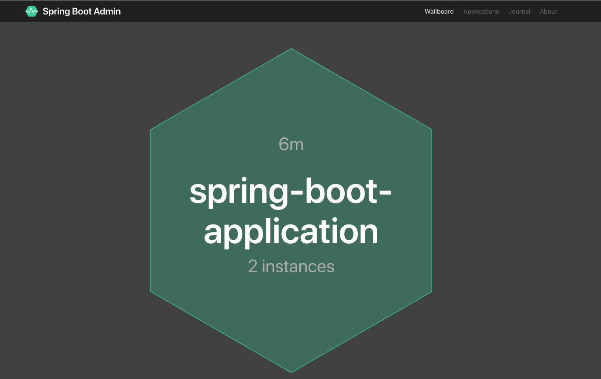
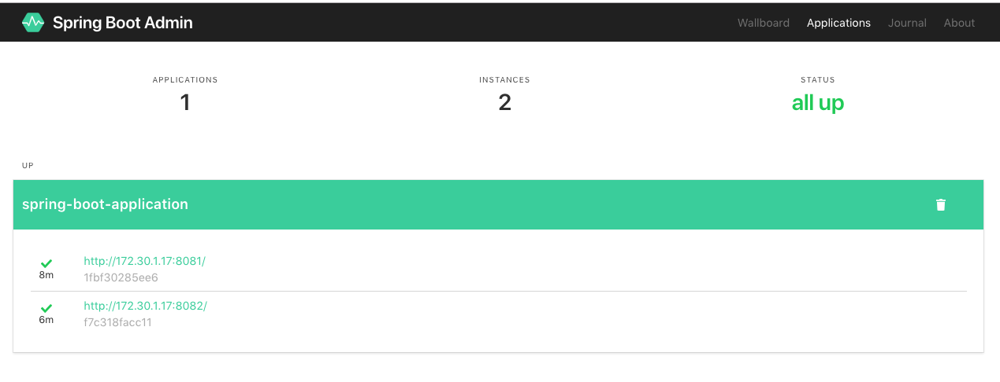
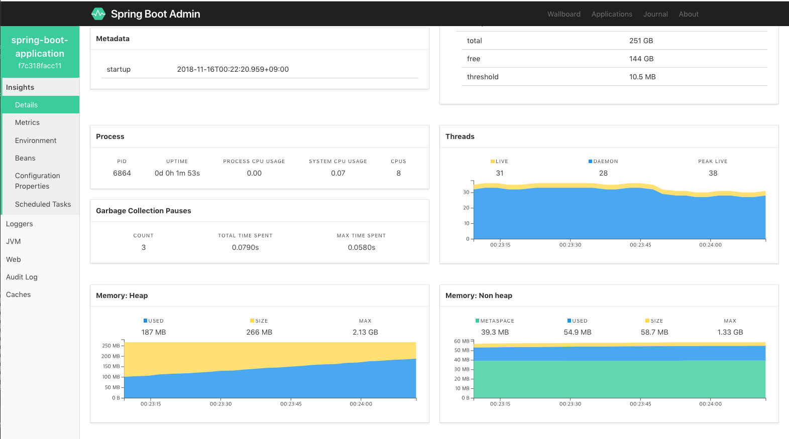
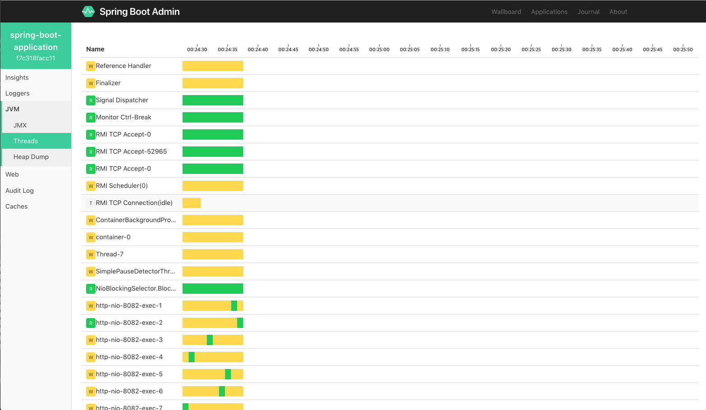
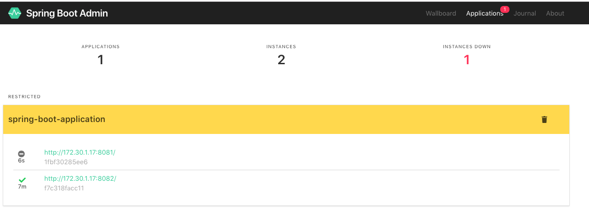

## Spring boot admin tutorial

### Description

> admin-servers

```sql
- monitoring server 생성시 admin-server dependency 를 추가 한다.
- @EnableAdminServer 어노테이션을 설정 하여, 해당 서버가 amdin-server 가 되도록 한다.
```

> admin-clients

```sql
- api01 / api02 서버 생성시 admin-client depenency 를 추가 한다.
- properties 에 admin.client.url 을 지정해준다.
- 서버의 리소스를 모니터링 하도록 아래와 같이 설정 해준다.
    spring.boot.admin.client.url=http://localhost:8080
    management.endpoints.web.exposure.include=*
    management.endpoint.health.show-details=always
```

### Sample server with api_01,api_02

_localhost:8080 admin-server 접속시 아래와 같이 api_01,api_02 서버 등록 상태를 보여준다.
_

> > 

_Applications 탭에서 등록된 서버들의 상태를 볼수있다._

> > 

_서버의 상태들을 체크 할 수있다._

> > 

_서버의 스레드 상태를 확인 할 수 있다._

> > 

_서버가 다운 되었을때 서버의 상태를 알려준다._

> > 

> 이외에도 많은 기능들을 제공 하고 있다.
